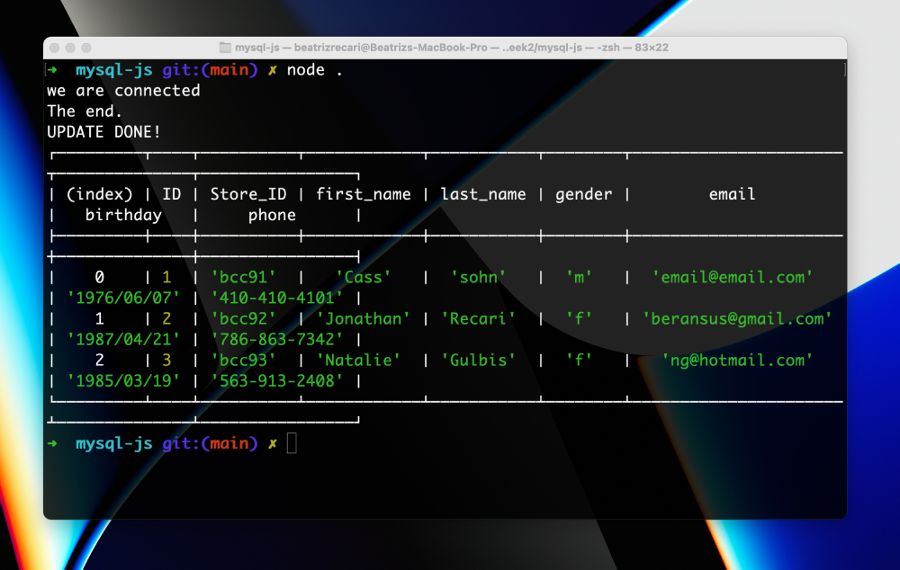

# MySQL with JavaScript 

Week 2, Day 2. Connecting MySQL with JavaScript using Node.

## Node Packages
- MySQL2

## MySQL 
- Version 8
    - localhost

## Lesson learned
1. Node
2. NPM
3. MySQL
4. Secrets

To see the repo [click here](https://bocacode.com).

